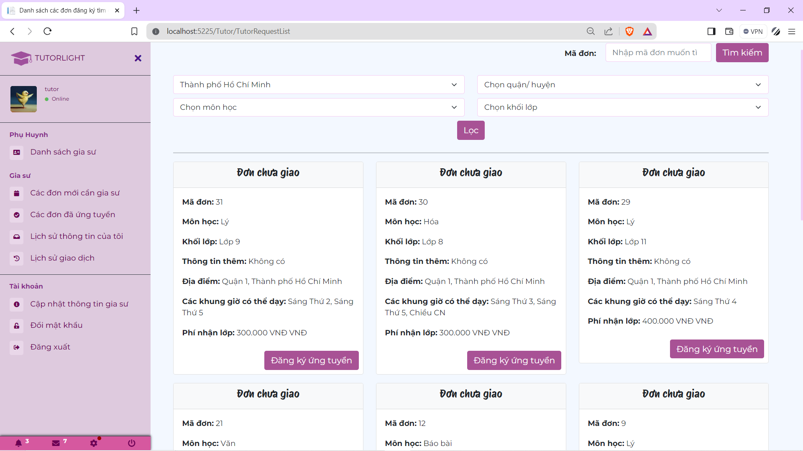
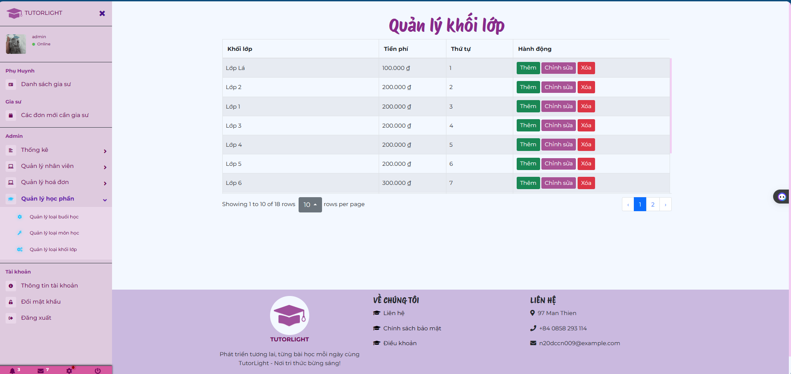
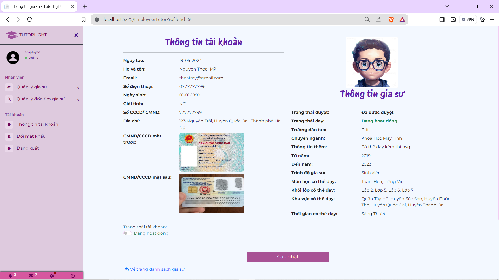
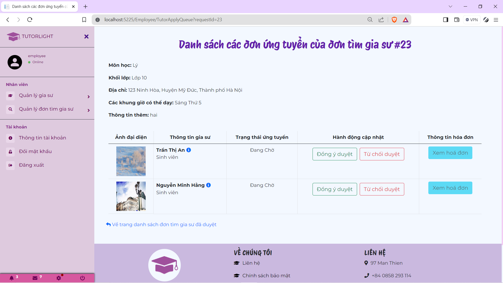
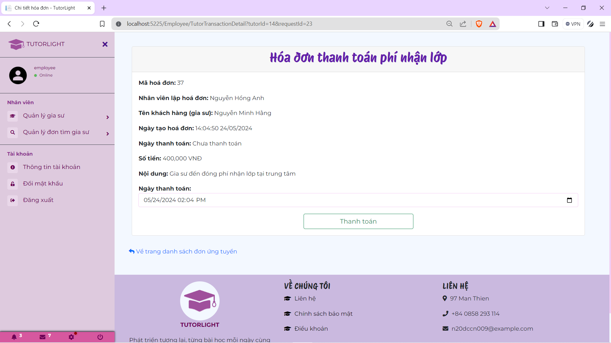
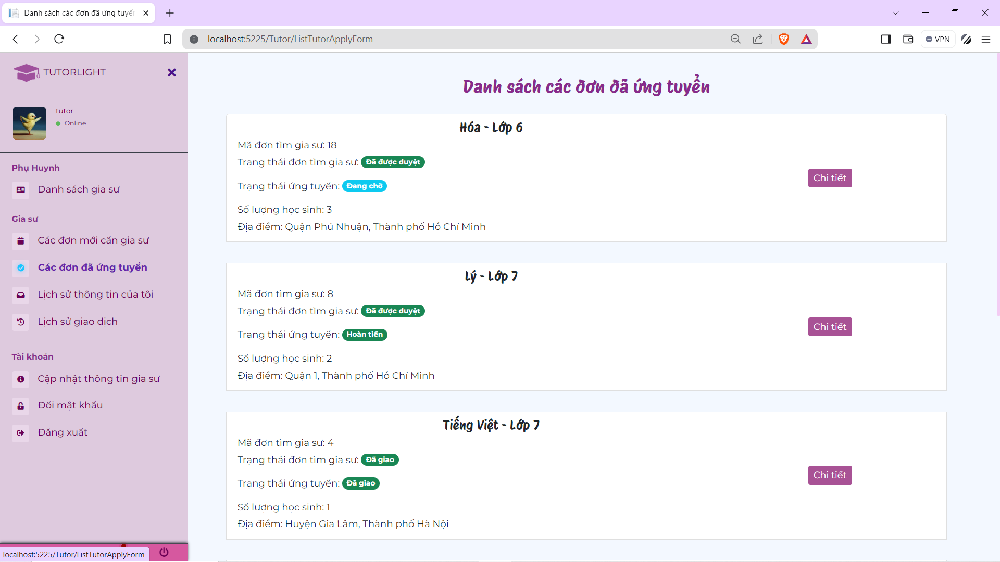

# Website Kinh Doanh Dịch Vụ Gia Sư
## Member
| Full Name | Email |
|-------------|------------|
| [Nguyễn Đức Chí Danh](https://github.com/Dan3105/)  | `chidanh0502@gmail.com` |
| [Hồ Đức Hoàng (Wibu)](https://github.com/Kiritokun0909) | `n20dccn018@student.ptithcm.edu.vn` |
| [Lương Thúy Vy](https://github.com/LuongThuyVy)  | `n20dccn085@student.ptithcm.edu.vn` |

## Description
This project involves the development of a comprehensive online platform for tutoring services. It facilitates the connection between students seeking tutoring and qualified tutors


- **Development Tools**: Visual Studio Code 
- **Programming Languages**: C#, Javascript, HTML, CSS
- **Frameworks**: 
	- .NET (7.0) 
	- Bootstrap 5.0
- **Database**: PostgreSQL
## Installation
### Docker-Compose Setup 
If you prefer to use docker-compose to run this project, follow these steps: 
1. Install [Docker: Accelerated Container Application Development](https://www.docker.com/) on your system. 
2. Clone this repository to your local machine.
	`> git clone https://github.com/Dan3105/TMDT_GiaSuService.git`
3. Navigate to the project directory
	 > in .env file, update the following variables according to your environment
**Note**:  Ensure that the values for `POSTGRES_USER`, `POSTGRES_PASSWORD`, and `POSTGRES_DB` are set to match your PostgreSQL database configuration.
4. Navigate to `GiaSuService/Services/UploadFileService.cs`
- Since project has used Firebase to saving image like avatar, identity image (front side of the card and back side of the card), so we have to config variables below to use Firebase services:


5. Navigate to the project directory and run docker-compose.yml
	```markdown 
	> cd %your_directory%  
	> docker-compose up -d
	```
	* **Note**: Building Docker images may take around 3-5 minutes
6. Access the application by opening your web browser and navigating to `http://localhost:5000`

## Features
0. Common Features:
    - Login
    
    - Register
     
    
    - View List of Tutors
    
    - View List of Tutor Requests
    
1. Admin Features:
	- Create Employee
    
	- Manage Catalog (Session, Subject, Grade)
    
	- View list of Invoice
    
	- Dashboard
    
2. Employee Features:
	- Manage Account of Tutors
    
	- Review Profile Tutor Applications
    
	- Review Tutor Applications with Changed Profiles
    
	- Review Tutor Requests
    
	- Manage Tutor Apply Applications in Tutor Request
    
	- Update Payment
    
3. Customer Features:
    - Create Tutor Requests
    
    - View Customer's Tutor Requests 
    
4. Tutor Features:
	- Apply to Tutor Request
    
	- View List of Tutor's applied Tutor Request
    
	- Request Changed Profiles 
    
	- View List of Tutor's Invoice
    

## References
- <a href="https://docs.google.com/document/d/1X0N2yA6C9T4QJeDXyyNrnt2laOWc0hum/edit?usp=sharing&ouid=101107901105800243767&rtpof=true&sd=true">Report Project </a>